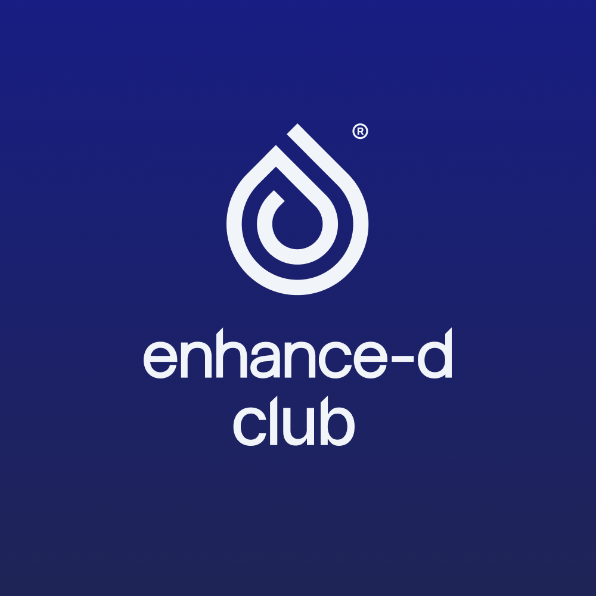

# Enhance-d Club Glucose - Karoo

**Professional glucose monitoring for Hammerhead Karoo cycling computers**

An Android application that fetches real-time blood glucose data from Nightscout servers and displays it as custom data fields on Hammerhead Karoo, Karoo 2, and Karoo 3 devices. Brought to you by Enhance-d Club.



## ⚠️ MEDICAL DISCLAIMER

**This is an OPEN SOURCE application intended for informational and educational purposes ONLY.**

### Important Warnings:

- **NOT for medical diagnosis, treatment, or decision-making**
- **NOT a replacement for professional medical advice**
- **NOT for emergency medical situations**
- **NOT for life-critical diabetes management decisions**

### Open Source Notice:

- This software is provided "AS IS" without warranty of any kind
- The developers and contributors are not medical professionals
- Code is publicly available and may be modified by anyone
- No regulatory approval has been sought or obtained
- You assume all risks associated with using open source medical software

### By using this app, you acknowledge that:

- You understand this is experimental open source software
- You will not use this app for medical treatment decisions
- You accept full responsibility for any consequences of use
- You will consult healthcare professionals for all medical advice
- You understand the limitations of open source medical tools

**Always consult qualified healthcare professionals for medical decisions.**

---

## 🚴‍♂️ Features

### Core Functionality

- **Real-time glucose monitoring** from Nightscout servers
- **Multiple data fields** for comprehensive glucose tracking
- **Color-coded display** based on glucose levels
- **Direction indicators** showing glucose trends
- **Time tracking** since last update
- **Delta calculations** for 5m and 15m changes

### Available Data Fields

#### Basic Fields
- **Glu. mg** - Blood glucose in mg/dL
- **Glu. mmol** - Blood glucose in mmol/L (1 decimal place)
- **Time Since (s)** - Seconds since last reading
- **Time Since (m)** - Formatted time (h:m:s) since last reading
- **Direction** - Glucose trend with arrow indicators (↑↑, ↑, ↗, →, ↘, ↓, ↓↓)

#### Delta Fields
- **15m Δ mg** - 15-minute glucose change in mg/dL
- **15m Δ mmol** - 15-minute glucose change in mmol/L
- **5m Δ mg** - 5-minute glucose change in mg/dL
- **5m Δ mmol** - 5-minute glucose change in mmol/L

#### Combo Fields (Graphical)
Combined fields that display multiple pieces of information in a single data field:

- **Combo 1 mg** - Left: Time since (s) and 15m delta with arrow | Right: Glucose value (mg/dL)
- **Combo 1 mmol** - Left: Time since (s) and 15m delta with arrow | Right: Glucose value (mmol/L)
- **Combo 2 mg** - Left: Time since (s) and 5m delta with arrow | Right: Glucose value (mg/dL)
- **Combo 2 mmol** - Left: Time since (s) and 5m delta with arrow | Right: Glucose value (mmol/L)
- **Combo 3 mg** - Left: Time since (m) and 15m delta with arrow | Right: Glucose value (mg/dL)
- **Combo 3 mmol** - Left: Time since (m) and 15m delta with arrow | Right: Glucose value (mmol/L)
- **Combo 4 mg** - Left: Time since (m) and 5m delta with arrow | Right: Glucose value (mg/dL)
- **Combo 4 mmol** - Left: Time since (m) and 5m delta with arrow | Right: Glucose value (mmol/L)

### Direction Indicators

- ↓↓ "DoubleDown" - Rapidly falling
- ↓ "SingleDown" - Falling
- ↘ "FortyFiveDown" - Slowly falling
- → "Flat" - Stable
- ↗ "FortyFiveUp" - Slowly rising
- ↑ "SingleUp" - Rising
- ↑↑ "DoubleUp" - Rapidly rising

---

## 📋 Prerequisites

### Required

1. **Active Nightscout website** with glucose data
2. **Hammerhead Karoo, Karoo 2, or Karoo 3** device
3. **Active data connection** (WiFi or cellular)
4. **USB debugging enabled** on Karoo device

### Data Usage Warning

- **Estimated usage**: ~1MB per hour of ride time
- **Data charges may apply** depending on your cellular plan
- **WiFi recommended** when available

---

## 🛠️ Installation

### Method 1: Hammerhead App Installation (Recommended)

1. **Download the APK** from the latest release
2. **Install the Hammerhead app** on your phone:
   - Available on [Google Play Store](https://play.google.com/store/apps/details?id=io.hammerhead.karoo) or [App Store](https://apps.apple.com/us/app/hammerhead-karoo/id1441752191)
3. **Connect your Karoo device** to the same WiFi network as your phone
4. **Open the Hammerhead app** and sign in with your Hammerhead account
5. **Navigate to Device Settings** in the app
6. **Select "Install APK"** or "Transfer APK" option
7. **Upload the downloaded APK** file to your Karoo device
8. **Follow the on-screen instructions** to complete installation

### Method 2: USB Debugging Installation

1. **Download the APK** from the latest release
2. **Enable USB debugging** on your Karoo device:
   - Go to Settings → About → Tap "Build Number" 7 times
   - Go to Settings → Developer Options → Enable "USB Debugging"
3. **Connect via USB** to your computer
4. **Install the APK**:
   ```bash
   adb install app-debug.apk
   ```

### Method 3: Build from Source

1. **Clone the repository**:
   ```bash
   git clone https://github.com/henryaspden/Enhance_d_Club_Glucose_Karoo.git
   cd Enhance_d_Club_Glucose_Karoo
   ```
2. **Build the project**:
   ```bash
   ./gradlew app:assembleDebug
   ```
3. **Install on device**:
   ```bash
   ./gradlew app:installDebug
   ```

### Installation Notes

- **First-time installation**: You may need to enable "Install from Unknown Sources" in your Karoo's security settings
- **App permissions**: The app will request necessary permissions on first launch
- **Medical disclaimer**: You must accept the medical disclaimer before using the app
- **Updates**: For app updates, uninstall the previous version before installing the new one

---

## ⚙️ Setup & Configuration

### Initial Setup

1. **Launch the app** from your Karoo's app drawer
2. **Accept the medical disclaimer** (required on first launch)
3. **Configure your Nightscout URL**:
   - Format: `https://yoursubdomain.yourdomain.tld/api/v1/entries/sgv.json`
   - Example: `https://mybloodglucose.herokuapp.com/api/v1/entries/sgv.json`
   - Local: `http://127.0.0.1:17580/sgv.json` (for local setups)
4. **Configure API Token** (optional):
   - If your Nightscout server requires authentication
   - Enter your API token in the Settings → API Token section
   - The token will be stored securely and visible in the interface
   - Use the toggle to hide the token for privacy if needed

#### **What are Nightscout Tokens?**

Nightscout tokens are authentication credentials that allow secure access to your Nightscout site. They act like a "key" that grants specific permissions to access your glucose data.

#### **When Do You Need a Token?**

**You need a token if:**

- Your Nightscout site is **not publicly accessible** (most common)
- Your site requires authentication to view data
- You want to restrict access to specific users
- Your site uses `AUTH_DEFAULT_ROLES` set to `denied`

**You don't need a token if:**

- Your Nightscout site is publicly accessible
- Your site allows anonymous read access
- You're using local xDrip+ without authentication

#### **Creating Nightscout Tokens:**

To create authentication tokens for your Nightscout site, follow the [official Nightscout documentation](https://nightscout.github.io/nightscout/admin_tools/):

1. **Access Admin Tools**: Click the settings panel (three horizontal bars) in your Nightscout website and select "Admin Tools"
2. **Create Token**: Click "Add New Subject" and choose the appropriate role:
   - **`readable`**: Read-only access (recommended for this app)
   - **`careportal`**: Can view and make treatment entries
   - **`admin`**: Full access
3. **Copy Token**: Use the generated token string for authentication

_Note: If you change your API_SECRET, all tokens will change and need to be updated._

### Nightscout API Sources

The app supports multiple Nightscout data sources:

#### 1. **Nightscout Server** (Cloud-based)

- **URL Format**: `https://yournightscout.com/api/v1/entries/sgv.json`
- **Use Case**: Standard cloud-hosted Nightscout instances
- **Requirements**: Internet connection, valid Nightscout URL
- **Authentication**: Optional API token for secure access
- **Example**: `https://mybloodglucose.herokuapp.com/api/v1/entries/sgv.json`

#### 2. **Phone Local Broadcast via Hotspot**

- **URL Format**: `http://[GATEWAY_IP]:17580/sgv.json`
- **Use Case**: xDrip+ or similar apps broadcasting glucose data
- **Requirements**: Phone hotspot enabled, xDrip+ configured for broadcast
- **Auto-detection**: App automatically detects gateway IP when connected to hotspot
- **Example**: `http://192.168.1.1:17580/sgv.json`
- **⚠️ Important Note**: Local broadcast from xDrip+ on a phone via hotspot may not be possible on recent Android devices due to Layer 2 Firewalls. This is a security feature in newer Android versions that prevents devices on the same network from communicating directly. If this method doesn't work, consider using a cloud-based Nightscout server or running xDrip+ locally on the Karoo device instead.

#### 3. **Local Karoo Device** (xDrip+ Local)

- **URL Format**: `http://127.0.0.1:17580/sgv.json`
- **Use Case**: xDrip+ running locally on the Karoo device
- **Requirements**: xDrip+ installed and configured on Karoo
- **Benefits**: No internet required, direct local access

### Quick Fill Options

The app provides convenient quick-fill buttons for common setups:

- **Local Web** - `http://127.0.0.1:17580/sgv.json` (e.g. xDrip+ installed on Karoo device)
- **Hotspot Device** - Auto-detects gateway IP and sets `http://[GATEWAY_IP]:17580/sgv.json` (⚠️ May not work on recent Android devices due to Layer 2 Firewalls)
- **Nightscout** - `https://mynightscout.com/api/v1/entries/sgv.json`

### App Settings

- **Auto Refresh** - Enable automatic data updates
- **Notifications** - Enable status notifications
- **API Token** - Optional authentication token for Nightscout servers
- **Restart App** - Apply configuration changes

---

## 🎯 Adding Data Fields to Karoo

### Step-by-Step Instructions

1. **Open Karoo Settings** on your device
2. **Navigate to** Ride Profiles → Edit Profile
3. **Add Data Fields**:
   - Tap the "+" button to add a new field
   - Search for "Enhance-d Club Glucose"
   - Select your desired data field
4. **Position the fields** where you want them on screen
5. **Save the profile**

### Recommended Field Layout

**Basic Layout:**
```
┌─────────────────────────────────┐
│ Glu. mg    Direction    Time    │
│ 145 mg/dL     ↗      00:02:15   │
│                                │
│ 15m Δ mg    5m Δ mg    Glu. mmol│
│   +12 mg/dL  +5 mg/dL   8.1 mmol│
└─────────────────────────────────┘
```

**Combo Field Layout (Space Efficient):**
```
┌─────────────────────────────────┐
│ Combo 1 mg    Combo 1 mmol      │
│ 120s +15 ↑    120s +0.8 ↑       │
│   145           8.1             │
│                                │
│ Combo 2 mg    Combo 2 mmol      │
│ 120s +5 ↗     120s +0.3 ↗      │
│   145           8.1             │
└─────────────────────────────────┘
```

The combo fields combine time since, delta, and direction on the left with the glucose value on the right, making efficient use of screen space.

---

## 🔧 Troubleshooting

### Common Issues

**App not appearing in Karoo data fields:**

- Ensure the app is installed and running
- Check that the extension service is active
- Restart the Karoo device

**No glucose data showing:**

- Verify your Nightscout URL is correct
- Check your internet connection
- Ensure your Nightscout site has recent glucose data
- Check the app's "Last Updated" time

**Data not updating:**

- Verify auto-refresh is enabled
- Check your data connection
- Restart the app if needed

**Connection errors:**

- Verify your Nightscout site is accessible
- Check firewall settings
- Try using a different network

**Hotspot connection issues:**

- Ensure phone hotspot is enabled
- Check that xDrip+ is configured to broadcast glucose data
- Verify the Karoo is connected to the phone's hotspot
- Try manually entering the gateway IP if auto-detection fails
- **⚠️ Layer 2 Firewall**: Recent Android devices may have Layer 2 Firewalls enabled that prevent devices on the same hotspot network from communicating directly. If hotspot broadcast doesn't work, this is likely the cause. Consider using a cloud-based Nightscout server or running xDrip+ locally on the Karoo device instead.

### Debug Information

- **App logs**: Check Android logcat for detailed error messages
- **Network status**: Verify connectivity to your Nightscout server
- **Data format**: Ensure Nightscout returns valid JSON data

---

## 📊 Data Format

The app expects glucose data in the Nightscout format:

```json
[
  {
    "_id": "689b739389c427000266181c",
    "sgv": 154,
    "direction": "FortyFiveDown",
    "device": "AAPS-DexcomG6",
    "mills": 1755018118000,
    "units": "mg/dl"
  }
]
```

### Required Fields

- `sgv` - Glucose value in mg/dL
- `direction` - Trend direction (see Direction Indicators above)
- `mills` - Timestamp in milliseconds

---

## 🎨 Color Coding

Glucose values are automatically color-coded:

- **🟢 Green (70-180 mg/dL)**: Normal range
- **🟠 Orange (>180 mg/dL)**: High glucose
- **🔴 Red (<70 mg/dL)**: Low glucose

---

## 🔄 Updates & Maintenance

### App Updates

- Check GitHub releases for new versions
- Uninstall previous version before installing new one
- Your settings will be preserved

### Nightscout Updates

- Ensure your Nightscout site is up to date
- Check for any API changes that might affect the app
- Verify data is being uploaded to Nightscout correctly

---

## 🤝 Contributing

We welcome contributions! Please:

1. **Fork the repository**
2. **Create a feature branch**
3. **Make your changes**
4. **Test thoroughly**
5. **Submit a pull request**

### Development Setup

- Android Studio 4.0+
- Android SDK 21+
- Karoo Ext library
- Nightscout test instance

---

## 📞 Support

### Getting Help

- **GitHub Issues**: Report bugs and request features
- **Documentation**: Check this README and code comments
- **Community**: Join diabetes and cycling communities

### Contact Information

- **GitHub**: [Repository Issues](https://github.com/henryaspden/Enhance_d_Club_Glucose_Karoo/issues)
- **Email**: uk@club.enhance-d.com

---

## 📄 License

This project is licensed under the Apache License 2.0 - see the [LICENSE](LICENSE) file for details.

---

## 🙏 Acknowledgments

- **Enhance-d Club UK** - Community support and inspiration for active living with type 1 diabetes
- **CGM in the Cloud** - Community-driven diabetes technology
- **xDrip+** - Open source diabetes management
- **Hammerhead** - Karoo platform and extension framework
- **Nightscout** - Open source CGM data platform

## 💪 About Enhance-d Club UK

**Enhance-d Club UK** is a not-for-profit community built by and for people living with type 1 diabetes who refuse to let it hold them back. From cyclists and runners to swimmers and weekend adventurers, we support each other to stay active, healthy, and connected.

### Our Mission:

- **💪 Empower** people with type 1 diabetes to live active, fulfilling lives
- **🚴 Create safe spaces** to share experiences, challenges, and wins
- **🤝 Build community** through meetups, events, and online support
- **🌍 Break down barriers** to access, so everyone can enjoy the benefits of sport and activity

### Support the Community:

Your support helps us keep the community thriving – from hosting meetups, to creating resources, to backing initiatives that make active living with type 1 diabetes more accessible to all.

**☕ Every coffee fuels community, connection, and action.**

_Together, we're proving that diabetes doesn't define limits._

---

## 📈 Version History

### v2.0.0 (Current)

- Updated version numbering
- Enhanced Nightscout API source documentation
- Improved hotspot detection and configuration
- Better error handling and user feedback
- Professional branding and medical disclaimers

### v0.1.0 (Previous)

- Initial release
- Basic glucose monitoring
- Multiple data fields
- Medical disclaimer
- Professional branding

### Planned Features

- Custom data field layouts
- Advanced trend analysis
- Integration with other diabetes apps
- Enhanced error handling
- Additional Nightscout API source support

---

**Remember: This app is for informational purposes only. Always consult healthcare professionals for medical decisions.**

_Brought to you by Enhance-d Club_
